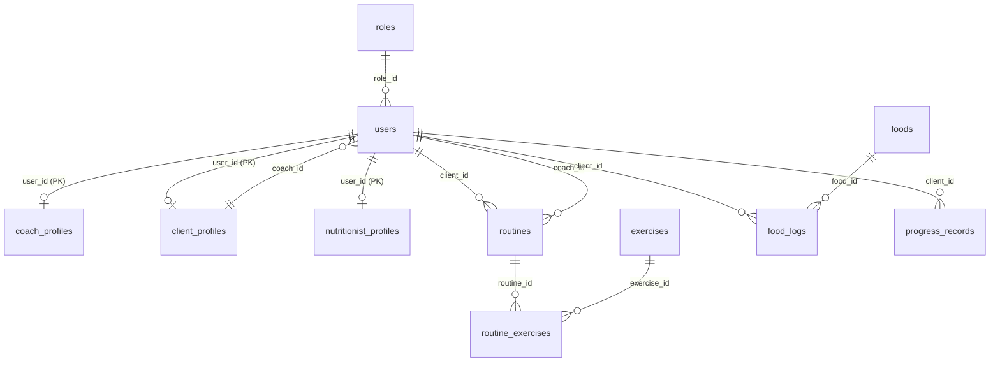

# Reporte de Auditoría y Diagnóstico Técnico — FitApp 🏋️‍♂️

Este reporte detalla el diagnóstico del sistema **FitApp**, cubriendo su arquitectura, modelos de datos, estado de los módulos de negocio, flujos de usuario, inconsistencias de código, y planes de remediación.

---

## 1. Arquitectura General

FitApp está estructurado como una aplicación web de dos capas (Frontend y Backend de forma independiente) con una base de datos relacional.

### Stack Tecnológico

| Componente | Tecnologías Utilizadas | Detalle / Propósito |
| :--- | :--- | :--- |
| **Frontend** | React 18 + TypeScript | SPA estructurada para la interacción de usuarios, estructurada con Vite como empaquetador. |
| | React Router DOM v6 | Gestión de enrutamiento del lado del cliente. |
| | Axios | Cliente HTTP para consumir los endpoints REST del backend. |
| | Framer Motion | Animaciones y transiciones fluidas de interfaz. |
| | Vanilla CSS | Hojas de estilo a medida basadas en variables globales CSS. |
| **Backend** | Node.js + Express + TS | API REST desarrollada en TypeScript, compilada y ejecutada mediante `ts-node` y `nodemon` en desarrollo. |
| | Autenticación JWT | JSON Web Tokens firmados simétricamente con hasheo de contraseñas mediante `bcryptjs`. |
| **Base de Datos** | MySQL 8.0 / MariaDB | Almacenamiento relacional con integridad referencial. Acceso mediante el controlador `mysql2/promise`. |
| **Almacenamiento** | Local Disk (`/uploads`) | Aunque el backend declara `cloudinary` y `multer-storage-cloudinary` en sus dependencias (`package.json`), el archivo `upload.ts` está configurado únicamente para almacenamiento local en disco. Además, esta configuración de subida no está conectada a ninguna ruta actual. |

### Estructura de Carpetas

La raíz del proyecto contiene dos directorios principales: `/frontend` y `/backend`.

```text
fitapp/
├── mer.pdf                  # Modelo Entidad-Relación (Documento base)
├── README.md                # Guía de ejecución del proyecto
├── backend/
│   ├── src/
│   │   ├── config/          # Conexión DB, Multer upload y configuraciones de permisos
│   │   ├── constants/       # Definición de ROLES del sistema
│   │   ├── controllers/     # Controladores que manejan las requests HTTP de cada módulo
│   │   ├── middleware/      # Middleware de autenticación y roles de Express
│   │   ├── models/          # Modelos SQL para consultas a base de datos
│   │   ├── routes/          # Definición de rutas del servidor Express
│   │   ├── types/           # Interfaces y tipos en TypeScript (User, Client, Coach)
│   │   ├── utils/           # Utilidades auxiliares (autenticación)
│   │   ├── index.ts         # Configuración del servidor de Express y mapeo de rutas
│   │   └── server.ts        # Punto de entrada para arrancar el servidor HTTP
│   ├── uploads/             # Carpeta local para almacenar imágenes subidas
│   ├── .env                 # Variables de entorno del backend
│   ├── package.json         # Dependencias y scripts del backend
│   └── schema.sql           # Script SQL para generación y llenado de la DB
└── frontend/
    ├── src/
    │   ├── assets/          # Recursos estáticos (imágenes, SVGs)
    │   ├── components/      # Componentes transversales (Sidebar, Layout)
    │   ├── context/         # AuthContext para sesión del usuario
    │   ├── pages/           # Vistas/páginas del enrutador
    │   │   ├── LoginPage.tsx, DashboardPage.tsx, FoodsPage.tsx, ...
    │   │   ├── ClientDetailPage.tsx, ClientFormPage.tsx, ...
    │   │   ├── ProgressPage.tsx, ProgressFormPage.tsx, ProgressComparePage.tsx
    │   │   ├── MyRoutinePage.tsx, RoutineDetailPage.tsx, ...
    │   │   └── CommunityPage.tsx, PaymentsPage.tsx, CoachProfilePage.tsx
    │   ├── services/        # Cliente api.ts configurado con interceptores de Axios
    │   ├── types/           # Tipos compartidos en el frontend
    │   ├── App.tsx          # Configuración del router y enrutamiento global
    │   ├── main.tsx         # Punto de entrada de React
    │   ├── index.css        # Variables de diseño y estilos globales
    │   └── App.css          # Estilos generales del App
    ├── package.json         # Dependencias y scripts del frontend
    ├── tsconfig.json        # Configuración de compilación TS
    └── vite.config.ts       # Configuración de Vite
```

### Comunicación entre Frontend y Backend

La comunicación se realiza mediante una **API REST sobre HTTP**:
- **Peticiones**: Envío de objetos JSON en el body de peticiones `POST`/`PUT`.
- **Autenticación**: Se realiza mediante un Token JWT.
  - El frontend guarda el token en `localStorage` tras el login exitoso.
  - Un interceptor de Axios (`frontend/src/services/api.ts`) inyecta automáticamente el token en cada cabecera HTTP: `Authorization: Bearer <token>`.
  - El backend valida el token mediante el middleware `requireAuth` (`backend/src/middleware/auth.ts`) y añade el objeto decodificado a `req.user`.
  - Si una petición responde con código `401 Unauthorized`, un interceptor de respuesta limpia la sesión y redirige al usuario a `/login`.

### Variables de Entorno y Configuración Relevante

- **Backend (`backend/.env`)**:
  - `PORT`: Puerto en el que corre la API (por defecto `3000`).
  - `DB_HOST`: Host de la base de datos (por defecto `127.0.0.1`).
  - `DB_USER`: Usuario de la base de datos (por defecto `root`).
  - `DB_PASS`: Contraseña de la base de datos.
  - `DB_NAME`: Nombre del esquema (por defecto `fitapp_db`).
  - `JWT_SECRET`: Llave secreta para la firma y verificación de tokens JWT.
- **Frontend (`frontend/.env`)**:
  - `VITE_API_URL`: Dirección de la API REST para el cliente de Axios (por defecto `http://localhost:3000/api`).

---

## 2. Modelos de Datos

La estructura de almacenamiento está definida en `backend/schema.sql` y consta de las siguientes tablas, vistas y semillas:

### Entidades y Tablas



#### 1. `roles`
Catálogo estático de roles en el sistema.
- `id` (TINYINT UNSIGNED, PK, Auto Increment)
- `nombre` (VARCHAR(50), NOT NULL, UNIQUE): Valores: `'admin'`, `'coach'`, `'client'`, `'nutritionist'`.
- `descripcion` (VARCHAR(255))

#### 2. `users`
Tabla centralizada de credenciales y datos básicos de cuenta.
- `id` (INT, PK, Auto Increment)
- `role_id` (TINYINT UNSIGNED, FK -> `roles.id`, NOT NULL)
- `nombre` (VARCHAR(100), NOT NULL)
- `email` (VARCHAR(150), NOT NULL, UNIQUE)
- `telefono` (VARCHAR(20))
- `password_hash` (VARCHAR(255), NOT NULL)
- `activo` (BOOLEAN, NOT NULL, DEFAULT TRUE)
- `created_at` (TIMESTAMP, DEFAULT CURRENT_TIMESTAMP)
- `updated_at` (TIMESTAMP, DEFAULT CURRENT_TIMESTAMP ON UPDATE CURRENT_TIMESTAMP)

#### 3. `coach_profiles`
Información detallada para entrenadores.
- `user_id` (INT, PK, FK -> `users.id` con `ON DELETE CASCADE`)
- `especialidad` (VARCHAR(100))
- `biografia` (TEXT)
- `created_at` (TIMESTAMP, DEFAULT CURRENT_TIMESTAMP)

#### 4. `client_profiles`
Asociación y métricas del atleta.
- `user_id` (INT, PK, FK -> `users.id` con `ON DELETE CASCADE`)
- `coach_id` (INT, FK -> `users.id`, NOT NULL): Entrenador asignado.
- `peso_kg` (DECIMAL(5,2))
- `altura_cm` (DECIMAL(5,2))
- `objetivo` (VARCHAR(255))
- `created_at` (TIMESTAMP)
- `updated_at` (TIMESTAMP)

#### 5. `nutritionist_profiles`
Información de nutricionistas.
- `user_id` (INT, PK, FK -> `users.id` con `ON DELETE CASCADE`)
- `especialidad` (VARCHAR(100))
- `created_at` (TIMESTAMP)

#### 6. `foods`
Catálogo de alimentos con valores nutricionales de base (por cada 100g).
- `id` (INT, PK, Auto Increment)
- `nombre` (VARCHAR(100), NOT NULL)
- `unidad` (VARCHAR(30), DEFAULT `'g'`)
- `calorias_por_100g` (DECIMAL(6,2), NOT NULL)
- `proteinas_g` (DECIMAL(5,2), DEFAULT 0)
- `carbohidratos_g` (DECIMAL(5,2), DEFAULT 0)
- `grasas_g` (DECIMAL(5,2), DEFAULT 0)

#### 7. `exercises`
Catálogo de ejercicios físicos.
- `id` (INT, PK, Auto Increment)
- `nombre` (VARCHAR(100), NOT NULL)
- `grupo_muscular` (VARCHAR(50))
- `tipo` (VARCHAR(50))
- `nivel` (VARCHAR(50))
- `descripcion` (TEXT)

#### 8. `routines`
Encabezado del plan de entrenamiento semanal.
- `id` (INT, PK, Auto Increment)
- `client_id` (INT, FK -> `users.id` con `ON DELETE CASCADE`, NOT NULL)
- `coach_id` (INT, FK -> `users.id`, NOT NULL)
- `nombre` (VARCHAR(100), NOT NULL)
- `fecha_inicio` (DATE, NOT NULL)
- `fecha_fin` (DATE)
- `activa` (BOOLEAN, DEFAULT TRUE, NOT NULL)
- `created_at` (TIMESTAMP)

#### 9. `routine_exercises`
Tabla puente con la parametrización de cada ejercicio en una rutina.
- `id` (INT, PK, Auto Increment)
- `routine_id` (INT, FK -> `routines.id` con `ON DELETE CASCADE`, NOT NULL)
- `exercise_id` (INT, FK -> `exercises.id` con `ON DELETE CASCADE`, NOT NULL)
- `series` (TINYINT UNSIGNED, DEFAULT 3, NOT NULL)
- `repeticiones` (TINYINT UNSIGNED)
- `peso_kg` (DECIMAL(5,2))
- `descanso_seg` (SMALLINT UNSIGNED, DEFAULT 60)
- `orden` (TINYINT UNSIGNED, DEFAULT 1, NOT NULL)

#### 10. `food_logs`
Registro diario de consumo de alimentos del cliente.
- `id` (INT, PK, Auto Increment)
- `client_id` (INT, FK -> `users.id` con `ON DELETE CASCADE`, NOT NULL)
- `food_id` (INT, FK -> `foods.id` con `ON DELETE CASCADE`, NOT NULL)
- `fecha` (DATE, NOT NULL)
- `tipo_comida` (VARCHAR(50)): Desayuno, Almuerzo, Cena, Snack.
- `cantidad_g` (DECIMAL(6,2), NOT NULL)
- `created_at` (TIMESTAMP)

#### 11. `progress_records`
Historial de mediciones de composición corporal de los clientes.
- `id` (INT, PK, Auto Increment)
- `client_id` (INT, FK -> `users.id` con `ON DELETE CASCADE`, NOT NULL)
- `fecha` (DATE, NOT NULL)
- `peso_kg` (DECIMAL(5,2), NOT NULL)
- `altura_cm` (DECIMAL(5,2), NOT NULL)
- `imc` (DECIMAL(5,2) GENERATED ALWAYS AS (peso_kg / ((altura_cm / 100) * (altura_cm / 100))) STORED): IMC autocalculado y persistido.
- `porcentaje_grasa` (DECIMAL(5,2))
- `masa_muscular_kg` (DECIMAL(5,2))
- `notas` (TEXT)
- `created_at` (TIMESTAMP)

### Vistas SQL creadas

1. `v_food_logs_detalle`: Realiza la conversión matemática del peso consumido contra el aporte calórico y de macronutrientes del catálogo (`foods`), devolviendo los subtotales netos de calorías, proteínas, carbohidratos y grasas ingeridas.
2. `v_progress_resumen`: Muestra los progresos de peso e IMC e incluye la diferencia (delta) de peso respecto al registro inmediato anterior de ese mismo cliente utilizando la función de ventana `LAG()`.
3. `v_users_con_rol`: Retorna los usuarios junto con la etiqueta textual de su respectivo rol.

---

## 3. Módulos y Funcionalidades

### Módulo de Entrenamiento (Rutinas)
- **¿Qué funciona hoy?**
  - Creación de cabeceras de rutinas vinculadas a un cliente y un coach (`POST /api/routines`).
  - Adición, actualización y remoción de ejercicios específicos en una rutina asignándoles series, repeticiones, peso y orden (`POST`/`PUT`/`DELETE` sobre `/api/routines/:id/exercises`).
  - Obtención de la rutina activa del cliente logueado (`GET /api/routines/client/:clientId`).
- **¿Qué está a medias?**
  - Catálogo de Ejercicios en la interfaz: Se puede ver la lista general y crear nuevos ejercicios, pero no hay asignación en pantalla ni buscador estructurado dentro del detalle de una rutina.
- **¿Qué está planeado pero no implementado?**
  - El coach no tiene acceso en la interfaz de usuario para entrar a gestionar rutinas directamente desde el atleta en `/clients/:id` debido a que la ruta en React Router está rota.

### Módulo de Nutrición
- **¿Qué funciona hoy?**
  - Catálogo completo de alimentos: Registro, búsqueda inteligente por nombre (`GET /api/foods?query=...`), edición y borrado de alimentos.
  - Diario de comidas del atleta (`GET`/`POST` sobre `/api/food-logs`): Agrupa los registros por tipo de comida (Desayuno, Almuerzo, Cena, Snack) y realiza sumas agregadas de calorías.
- **¿Qué está a medias?**
  - El objetivo calórico diario del cliente no se guarda en ningún lado de la base de datos; la función `getClientObjetivoCalorico` del backend retorna directamente un valor duro de `2000` kcal para todos los usuarios.
  - El cliente no puede eliminar sus propios registros de comida en producción ya que la ruta del backend `DELETE /api/food-logs/:id` tiene el middleware `requireRole('admin', 'coach')`, lo cual contradice la lógica interna del controlador `food_logs.controller.ts` que sí permite al cliente borrar si es dueño del registro.
- **¿Qué está planeado pero no implementado?**
  - Gráficas de balance de macronutrientes diarias.
  - Gestión de menús o planes nutricionales semanales del coach hacia el cliente.

### Módulo de Seguimiento (Progreso)
- **¿Qué funciona hoy?**
  - Cálculo automático a nivel base de datos del Índice de Masa Corporal (IMC) y el delta de ganancia/pérdida de peso.
  - Endpoints básicos del backend para registrar medidas, comparar dos fechas (`GET /api/progress/:clientId/compare`) y listar el historial de avances.
- **¿Qué está a medias / roto?**
  - El flujo en el frontend está completamente desconectado. Las páginas `ProgressPage.tsx`, `ProgressFormPage.tsx` y `ProgressComparePage.tsx` están diseñadas visualmente pero no se puede acceder a ellas porque no se registraron sus rutas en `App.tsx`.
  - Inconsistencia de endpoints: El frontend apunta a `GET /api/progress/client/:clientId` pero el backend espera `GET /api/progress/:clientId`. Esto causa que el backend reciba la cadena `'client'` como ID del cliente, retorne `NaN` y falle internamente.
  - Discordancia de datos: El formulario y la vista de progreso en React esperan campos como medidas de cintura, cadera, pecho y fotos físicas. El backend y la base de datos ignoran y carecen de estas columnas, por lo que nunca se guardan.
  - Restricción de permisos absurda: Un cliente no puede crear registros de su propio progreso debido a que el endpoint `POST /api/progress/:clientId` está limitado por la API a los roles `'admin'` y `'coach'`.

### Módulo de Coaches y Clientes
- **¿Qué funciona hoy?**
  - El coach puede iniciar sesión, ver su lista de atletas asignados, y registrar nuevos atletas a su cargo.
- **¿Qué está a medias / roto?**
  - Ficha de Atleta Inaccesible: La vista `ClientDetailPage.tsx` es inaccesible porque la ruta `/clients/:id` no está definida en el enrutamiento de React.
  - Mapeo de datos erróneo: Si el coach lograra acceder a `/clients/:id`, las métricas de peso y altura se mostrarían vacías debido a que el componente busca `client.peso` y `client.altura`, pero la API retorna `peso_kg` y `altura_cm`. Asimismo, busca `imc` y `% grasa` en la llamada del cliente, pero el endpoint `GET /api/clients/:id` de la API no une ni consulta las tablas de progreso para devolver dichos valores.
  - El cliente no puede ver su entrenador: La página `CoachProfilePage.tsx` (ruta `/my-coach`) llama a `/api/coaches/my-coach`, pero dicho endpoint no existe en el backend. El backend interpreta `'my-coach'` como el ID numérico del coach, provocando un error.

### Módulos Adicionales (Comunidad y Pagos)
- **¿Qué funciona hoy?**
  - Las páginas `CommunityPage.tsx` y `PaymentsPage.tsx` están maquetadas en el frontend.
- **¿Qué está a medias / no implementado?**
  - **Ambos módulos no existen en el backend**. En `schema.sql` hay drops para `posts` y `payments` pero no se crea ninguna tabla. Tampoco existen archivos de rutas, modelos o controladores para `/posts` o `/payments`. Si un usuario navega a estas secciones en el frontend, el sistema devolverá errores de conexión/API.

---

## 4. Flujos de Usuario

### Flujo del Atleta / Cliente
1. **Registro / Inicio de Sesión**: Se autentica utilizando su correo y contraseña. (El registro inicial requiere que sea pre-creado por el coach en la base de datos o por un administrador, especificando su peso, altura, objetivo y el ID de su coach).
2. **Dashboard Principal**:
   - Visualiza su consumo calórico acumulado contra la meta diaria (fijada en 2000 kcal).
   - Ve el nombre de su rutina activa asignada.
   - Ve el número total de mediciones físicas que tiene registradas.
3. **Acciones Disponibles**:
   - **Ver su plan activo**: Accede a su rutina diaria (`/my-routine`) donde visualiza los ejercicios ordenados con sus series, repeticiones, descansos y carga de trabajo asignada.
   - **Registro de Comidas**: Accede a `/food-log` para registrar qué ha comido en el día (Desayuno, Almuerzo, Cena, Snack), buscando los alimentos del catálogo común del gimnasio.
4. **Flujos rotos en su perfil**:
   - No puede ver el perfil de su coach asignado (el endpoint `/coaches/my-coach` devuelve 404/500).
   - No puede ver ni registrar su propio historial físico en la sección "Mi Progreso" (rutas no declaradas y endpoint restringido por rol).

### Flujo del Coach / Entrenador
1. **Registro**: Se crea su cuenta y se le asigna un perfil vacío en `coach_profiles`.
2. **Dashboard Principal**:
   - Ve la estadística del total de atletas bajo su cargo.
   - Tiene un buscador y lista de tarjetas de sus atletas con peso, altura y objetivo.
3. **Acciones Disponibles**:
   - **Crear atletas**: Registra nuevos clientes directamente asignándoles peso, altura y objetivo.
   - **Gestionar Catálogos**: Revisa los ejercicios y alimentos disponibles.
   - **Planificación**: Diseña rutinas en `/routines` asignándolas a un atleta en específico.
4. **Flujos rotos en su perfil**:
   - No puede abrir el perfil/detalle de ningún cliente individual para ver su evolución o editar su perfil ya que la ruta `/clients/:id` no existe en el router de React.
   - No puede gestionar el avance del cliente desde la interfaz del panel.

### Flujo del Administrador
1. **Registro**: Se accede exclusivamente mediante semillas del sistema.
2. **Dashboard**: Consola global con conteo exacto de tablas críticas (usuarios, alimentos, ejercicios y rutinas). Enlaces rápidos a todos los módulos.
3. **Acciones**: Puede crear alimentos y ejercicios en los catálogos globales, activar/desactivar cualquier tipo de usuario en el sistema.
4. **Flujos rotos**: Mismas redirecciones forzadas al dashboard en componentes que intentan enlazar con clientes, perfiles de coaches o progresos.

---

## 5. Inconsistencias y Problemas Detectados

A continuación, se tabula el inventario de hallazgos críticos detectados tras la auditoría del código fuente:

| # | Severidad | Tipo | Descripción de la Inconsistencia o Error | Origen (Archivo/Línea) |
| :--- | :--- | :--- | :--- | :--- |
| **1** | 🔥 **Crítica** | Enrutamiento Frontend | Las rutas principales para `/clients/:id`, `/clients/new`, `/progress`, `/progress/new/:clientId` y `/progress/compare` están importadas pero **no declaradas** en el componente de enrutamiento global de React, haciendo que cualquier navegación a estas redireccione al Dashboard. | [App.tsx](file:///home/cristian/FitApp/frontend/src/App.tsx#L48-L61) |
| **2** | 🔥 **Crítica** | Endpoint Roto | La página de progreso hace una petición a `/progress/client/:clientId`. El backend tiene declarada la ruta como `/:clientId` (quedando como `/api/progress/:clientId`). El servidor mapea la palabra `'client'` como el ID, lo que al parsear a entero da `NaN` y aborta la transacción con error HTTP 500. | [ProgressPage.tsx](file:///home/cristian/FitApp/frontend/src/pages/ProgressPage.tsx#L31) vs [progress.routes.ts](file:///home/cristian/FitApp/backend/src/routes/progress.routes.ts#L14) |
| **3** | 🔥 **Crítica** | Endpoint Roto | El cliente intenta cargar el perfil de su entrenador haciendo `GET /api/coaches/my-coach`. Sin embargo, el backend carece de ese endpoint y procesa la palabra `'my-coach'` como ID numérico, retornando error. | [CoachProfilePage.tsx](file:///home/cristian/FitApp/frontend/src/pages/CoachProfilePage.tsx#L19) vs [coaches.routes.ts](file:///home/cristian/FitApp/backend/src/routes/coaches.routes.ts#L10) |
| **4** | 🔴 **Alta** | Base de Datos Incompleta | El módulo de Comunidad (`/community`) interactúa con `/posts` y el módulo de Pagos (`/payments`) con `/payments`, pero en el backend no existen sus correspondientes tablas en `schema.sql` (solo están los `DROP TABLE`), ni se crearon los controladores y endpoints de la API. Ambos módulos están simulados y fallan al interactuar. | [schema.sql](file:///home/cristian/FitApp/backend/schema.sql#L20-L21) vs [index.ts (backend)](file:///home/cristian/FitApp/backend/src/index.ts#L22-L30) |
| **5** | 🔴 **Alta** | Mapeo de Nombres | `ClientDetailPage.tsx` intenta leer `client.peso` y `client.altura` del objeto de respuesta, pero la base de datos y la API retornan `peso_kg` y `altura_cm`, lo que resulta en datos vacíos (`--`) en la interfaz. | [ClientDetailPage.tsx](file:///home/cristian/FitApp/frontend/src/pages/ClientDetailPage.tsx#L45-L49) vs [clients.controller.ts](file:///home/cristian/FitApp/backend/src/controllers/clients.controller.ts#L46) |
| **6** | 🔴 **Alta** | Columnas Faltantes | El frontend permite rellenar e intenta renderizar variables como medidas de cintura, cadera, pecho y fotos corporales. La base de datos y el modelo del backend ignoran estas variables en absoluto, perdiendo los datos enviados. | [ProgressFormPage.tsx](file:///home/cristian/FitApp/frontend/src/pages/ProgressFormPage.tsx#L16-L28) vs [schema.sql (progress_records)](file:///home/cristian/FitApp/backend/schema.sql#L155-L170) |
| **7** | 🟡 **Media** | Control de Permisos | Un cliente tiene prohibido borrar sus comidas registradas (`DELETE /api/food-logs/:id`) o registrar su avance físico (`POST /api/progress/:clientId`) en las rutas de la API, a pesar de que el código interno de los controladores asume que el cliente debería ser capaz de hacer ambas cosas si es dueño del recurso. | [food_logs.routes.ts](file:///home/cristian/FitApp/backend/src/routes/food_logs.routes.ts#L11) vs [food_logs.controller.ts](file:///home/cristian/FitApp/backend/src/controllers/food_logs.controller.ts#L111) |
| **8** | 🟡 **Media** | Código Muerto / Inútil | El backend cuenta con un archivo `permissions.ts` con configuraciones por roles de usuario, pero el backend jamás lo importa ni lo aplica para validar los permisos. Asimismo, intenta importar `Rol` de un archivo `../types/roles` inexistente. | [permissions.ts](file:///home/cristian/FitApp/backend/src/config/permissions.ts#L1) |
| **9** | 🟡 **Media** | Subida de Imágenes Inoperativa | Existe el archivo `upload.ts` configurado con Multer para guardado local en `/uploads`, pero en ningún archivo de rutas de la API del backend se importa o aplica este middleware, impidiendo la subida de imágenes en todo el sistema. | [upload.ts](file:///home/cristian/FitApp/backend/src/config/upload.ts) |
| **10** | 🟢 **Baja** | Lógica Cableada (Hardcoded) | En `foodLogModel.ts`, el método `getClientObjetivoCalorico` tiene harcodeada una meta genérica de 2000 calorías para todos los clientes, debido a la ausencia de dicho campo parametrizable en `client_profiles`. | [foodLogModel.ts](file:///home/cristian/FitApp/backend/src/models/foodLogModel.ts#L106) |

---

## 6. El Agente de IA

### Estado Actual del Agente
**El agente de IA no existe en la implementación actual del proyecto**.
- No se han agregado dependencias de modelos generativos (tales como `@google/generative-ai` o `openai`) en el backend ni en el frontend.
- No hay ningún endpoint habilitado en la API del backend para procesamiento de lenguaje natural o asistencia inteligente.
- No hay prompts base de comportamiento del sistema ni herramientas asociadas (Tools / Function Calling) definidas en los directorios examinados.

### Estrategia de Implementación Recomendada
Para integrar asistencia inteligente orientada a asesorar atletas y apoyar la planeación de coaches en FitApp, se proponen los siguientes pasos:
1. **Creación del Módulo en Backend**: Integrar el SDK oficial de Google Gemini en `/backend`.
2. **Definición del Endpoint de Chat**: Implementar una ruta `POST /api/ai/chat` (resguardada por el middleware `requireAuth`) para entablar conversaciones de asesoramiento en base a los datos corporales del usuario y sus objetivos.
3. **Diseño del System Prompt**:
   ```text
   Eres un Asistente Deportivo e Inteligente de FitApp. Tu objetivo es aconsejar y motivar
   al usuario en sus rutinas y alimentación, basándote estrictamente en sus métricas actuales.
   [Datos provistos por el contexto del cliente: Peso, Altura, IMC, Objetivo, Rutina Activa].
   No prescribas medicamentos y sé conciso.
   ```
4. **Herramientas (Tools)**: Habilitar *Function Calling* en la API de Gemini para que el modelo pueda invocar automáticamente las funciones de base de datos para consultar alimentos calóricos o ejercicios si el usuario lo solicita en el chat.
5. **Interfaz de Usuario**: Agregar una página `/chat` interactiva en el Frontend accesible a través del Sidebar.

---

## 7. Resumen Ejecutivo

El sistema actualmente puede registrar usuarios por roles, gestionar catálogos de alimentos y ejercicios físicos, diseñar y asignar rutinas de entrenamiento del lado de los coaches hacia los atletas, y llevar el registro calórico diario de comidas consumidas calculando macronutrientes mediante vistas SQL. Los principales cuellos de botella son que múltiples vistas clave del frontend están completamente inaccesibles por la falta de registro de rutas en React Router, existen endpoints críticos que provocan errores de tipo 500 al parsear parámetros inválidos (como `/progress/client/:clientId` y `/coaches/my-coach`), la subida física de imágenes no está conectada en las rutas, y módulos completos de negocio como Comunidad y Pagos están ausentes en el backend. Para llegar a un sistema coherente y optimizado, los pasos prioritarios son corregir las rutas de React Router DOM en el frontend para habilitar las vistas de progreso y detalles de clientes, alinear los endpoints en el backend para admitir correctamente las rutas solicitadas por el cliente, crear las tablas y endpoints para los módulos de Pagos y Comunidad, y agregar los campos de medidas y archivos en la base de datos de progresos activando el middleware de Multer para la subida de fotos.
